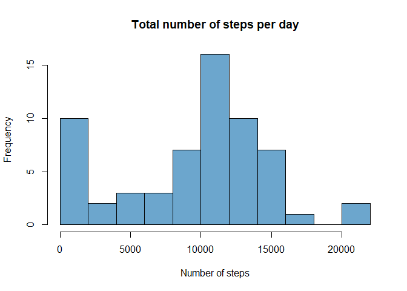
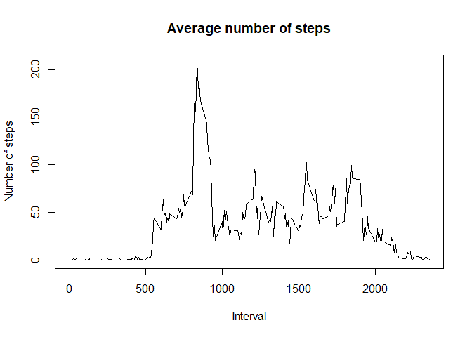
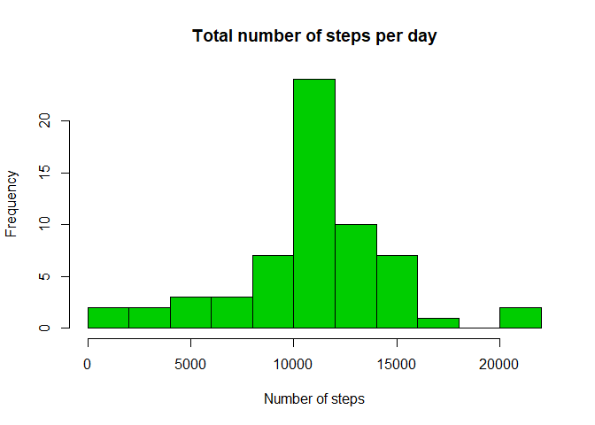

## Loading and preprocessing the data

Load and unzip the dataset if needed. 


```r
library(dplyr)
library(lattice)
```


```r
filezip <- "activity.zip"
filename <- "activity.csv"

if (!file.exists (filename)){
    unzip (filezip) 
}

activity <- read.csv (filename, sep=",")

#Convert date into Date class
activity$date = as.Date (activity$date, format = "%Y-%m-%d") 
```


## What is mean total number of steps taken per day?


```r
#calculate totals per day
activityPerDay <- activity %>% 
    group_by(date) %>% 
    summarise(total = sum(steps, na.rm = TRUE))

# histogram with 10 bins
hist (activityPerDay$total, main = "Total number of steps per day", xlab="Number of steps", 
      breaks = 10, col = "skyblue3")
```

<!-- -->

Mean and median of the total number of steps


```r
meanSteps <- mean (activityPerDay$total)
medianSteps <- median (activityPerDay$total)
```

Mean number of steps per day 9354.2295082
Median number of steps per day 10395


## What is the average daily activity pattern?


```r
# calculate average number of steps per interval
activityPerInt <- activity %>% 
    group_by(interval) %>% 
    summarise(avg = mean(steps, na.rm = TRUE))

# use base plotting system 
with (activityPerInt, plot (avg ~ interval, type = "l", 
                          ylab = "Number of steps",
                          xlab = "Interval"))
title ("Average number of steps")
```

<!-- -->

Interval with the maximum number of steps


```r
interval <- as.integer (activityPerInt [which.max (activityPerInt$avg), 1])
hour <- as.integer (interval/100)
minute <- as.integer (interval - hour*100)
interval
```

```
## [1] 835
```


Maximum number of steps occur at 8:35.


## Inputing missing values

Number of NA values

```r
sum (is.na (activity$steps))
```

```
## [1] 2304
```

Replace missing value with average value for a given interval


```r
# create a new data set with NA replaced by an average value
completeActivity <- activity
for (row in 1:nrow (activity)) {
    if (is.na (activity[row, "steps"])) {
        rowInt <- activity[row, "interval"]
        completeActivity [row, "steps"] <- activityPerInt [activityPerInt$interval == rowInt, "avg"]
    }
}

# validate that there are no additional NA values
sum (is.na (completeActivity$steps))
```

```
## [1] 0
```


```r
# calculate average number of steps per interval in the new data set
completeActivityPerDay <- completeActivity %>% 
    group_by(date) %>% 
    summarise(total = sum(steps))

hist (completeActivityPerDay$total, main = "Total number of steps per day", xlab="Number of steps", 
      breaks = 10, col = "green3")
```

<!-- -->

Mean and median of the total number of steps

Modified data set


```r
mean (completeActivityPerDay$total)
```

```
## [1] 10766.19
```

```r
median (completeActivityPerDay$total)
```

```
## [1] 10766.19
```

Original data set


```r
mean (activityPerDay$total)
```

```
## [1] 9354.23
```

```r
median (activityPerDay$total)
```

```
## [1] 10395
```

The difference between those two results is caused by sum( ... , na.rm = TRUE). ) For the calculation 0 is used instead of NA. Days with empty intervals only are thus contirbuting 0 to the total in the original data set but are still counted towards the average
The modified data set will use an average value instead, raising the average for empty days. 

The median of the updated sets is changed as well. Due to using average values, days with NA only will have a total number equivalent to the average of the totals across the set. Since there is more than one such day, this leads to the median being the same as mean.

## Are there differences in activity patterns between weekdays and weekends?


```r
completeActivity$day <- 
    ifelse (weekdays(completeActivity$date) =="Sunday" | weekdays(completeActivity$date) == "Saturday",
            "weekend", "weekday")


completeActivityPerInt <- completeActivity %>% 
    group_by(interval, day) %>% 
    summarise(avg = mean(steps))

xyplot(avg ~ interval | day, data = completeActivityPerInt, type="l", 
       layout = c(1, 2),
       ylab = "Number of steps")
```

<!-- -->

The pattern between weekends and weekdays are markedly different. Weekdays show significant activity in the morning followed by singnificantly lower activity. 
Weekend shows activity spread out evenly over the day (waking hours).
